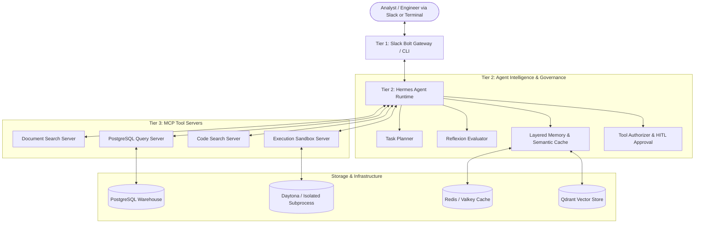

# Hermes Cortex

[](https://www.python.org/)
[](https://modelcontextprotocol.io/)
[](https://hermes-agent.nousresearch.com/)
[](LICENSE)
[]()

**Hermes Cortex** is an enterprise-grade autonomous research and data engineering platform. Powered by the official **Hermes Agent** runtime, Google Gemini, and the **Model Context Protocol (MCP)**, it empowers analysts and engineers to securely query production databases, search internal documentation, inspect codebases, and run sandboxed Python computations through a conversational interface.

---

## Quick Navigation

- [Architecture Overview](#architecture-overview)
- [Key Features](#key-features)
- [MCP Tool Servers](#mcp-tool-servers)
- [Setup & Environment Guide (SETUP.md)](SETUP.md)
- [Quick Start](#quick-start)
- [Verification & Quality Gates](#verification--quality-gates)

> [!IMPORTANT]
> For a step-by-step walkthrough on how to generate your **Google Gemini API Key**, **Slack Tokens**, and configure all environment variables, see the **[Complete Setup Guide (SETUP.md)](SETUP.md)**.

---

## Architecture Overview

Hermes Cortex implements a decoupled 3-tier architecture:



---

## Key Features

- **Official Hermes Agent Runtime (`hermes-agent==0.19.0`):** Native Model Context Protocol (MCP) client, multi-turn reasoning loops, and provider management.
- **Deterministic SQL Safety:** Read-only query enforcement (only `SELECT`, CTE `WITH`, and `EXPLAIN` queries are executed; destructive mutations are rejected).
- **Sandboxed Code Execution:** Dynamic Python execution in isolated Daytona cloud containers or restricted local sub-processes with CPU/memory limits and timeouts.
- **Layered Memory & Semantic Caching:** Session history, episodic execution traces, and tenant-isolated semantic caching for sub-millisecond repeated queries.
- **Human-in-the-Loop (HITL) Governance:** Risk-tiered authorization workflows with explicit approval requirements for high-impact actions.

---

## MCP Tool Servers

| Server | Exposed Tools | Capabilities & Safety Guarantees |
| :--- | :--- | :--- |
| **PostgreSQL Query** | `run_sql`, `list_tables` | Deterministic read-only SQL validation; rejects all mutations; connection pooling via `asyncpg`. |
| **Document Search** | `search_docs` | Relevance ranking, category-based metadata filtering, bounded excerpt generation. |
| **Code Search** | `search_code` | Path traversal protection (`../` blocked), regex search, exclusion of sensitive files (`.env`, `.pem`). |
| **Execution Sandbox** | `run_python` | Daytona cloud container isolation with local isolated subprocess fallback; strict 30s timeout. |

---

## Quick Start

### 1. Installation & Environment Configuration
Follow the **[Setup Guide (SETUP.md)](SETUP.md)** to install dependencies and create your `.env` file with your Gemini API key:

```bash
# Clone the repository
git clone https://github.com/msaif-dev/hermes-cortex.git
cd hermes-cortex

# Install dependencies
pip install -e ".[dev,cli]"

# Configure environment
cp .env.example .env
# Edit .env and paste your GEMINI_API_KEY (see SETUP.md for details)
```

### 2. Launch the Interactive Agent
```bash
# Windows
.\hermes

# Linux / macOS
hermes
```

### 3. Example Queries
Once inside the Hermes shell, you can interact with all MCP tools in natural language:

- *"List all public tables in our database using postgres_query, and show the top 5 rows."*
- *"Search our analytical documents for recent quarterly reports."*
- *"Execute a Python script in execution_sandbox to compute a rolling average of revenue."*

---

## Verification & Quality Gates

Run the automated test suite and static analysis checks:

```bash
# 1. Run all 79 unit, integration, and smoke tests
pytest tests/ -v

# 2. Strict static type analysis
mypy src/ tests/

# 3. Linting and format checks
ruff check src/ tests/
ruff format --check src/ tests/
```

---

## License

This project is licensed under the MIT License — see the [LICENSE](LICENSE) file for details.
